## Project: Movie Picture Pipeline
Movie Picture Pipeline
You are the DevOps engineer for a development team that manages a web application that is a catalog of Movie Picture movies. The team needs to automate its development workflows to accelerate its release cycle. You will use GitHub Actions to automate testing, building, and deploying applications to an existing Kubernetes cluster.

The team's project is comprised of 2 applications.

A frontend UI built written in Typescript, using the React framework
A backend API written in Python using the Flask framework.

### Build CI Pipeline for Frontend
1. Workflow with Github Action (Backend, Frontend)

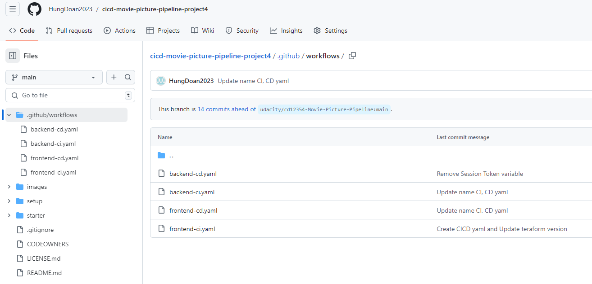

2. Frontend CI
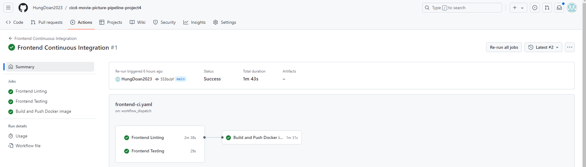

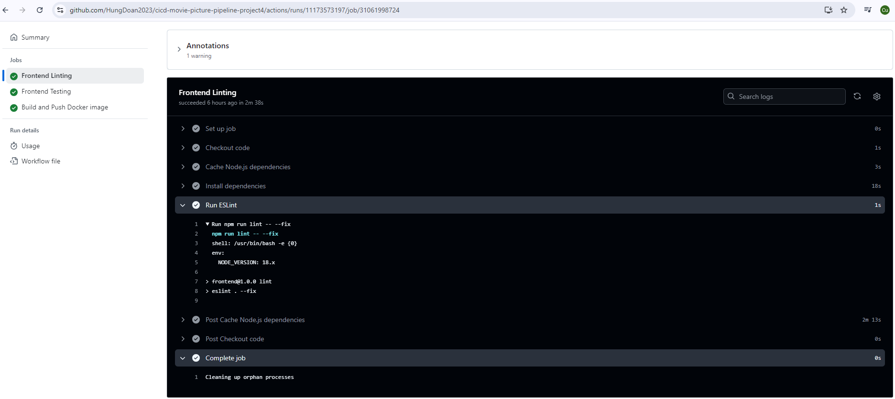

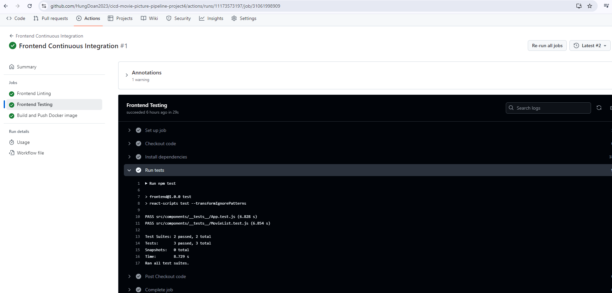

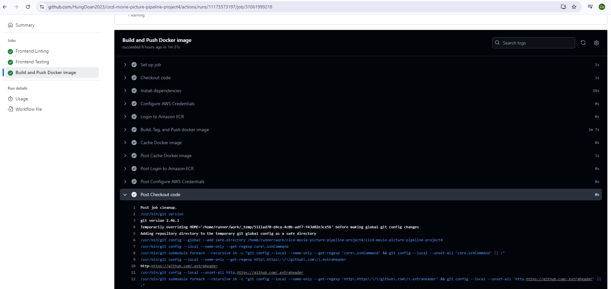

### Build CD Pipeline for Frontend
1. Frontend Continuouse Deployment (CD)

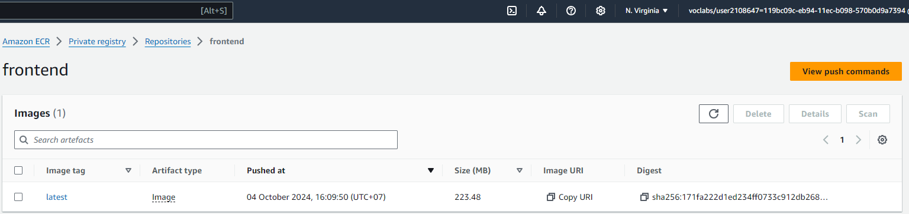

### Build CI Pipeline for Backend
1. Backend Continuous Integration (CI)
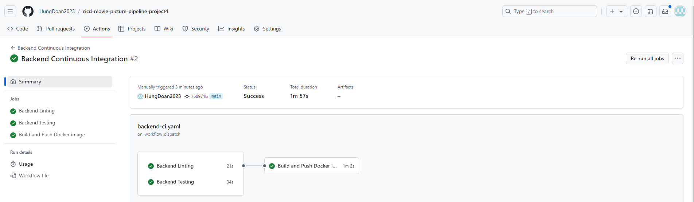

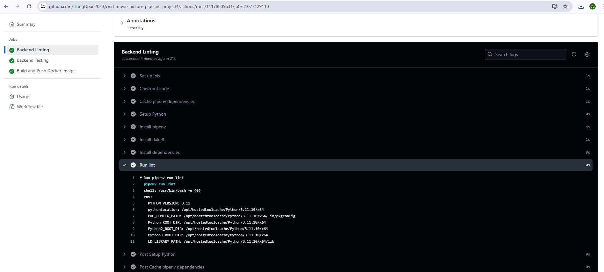

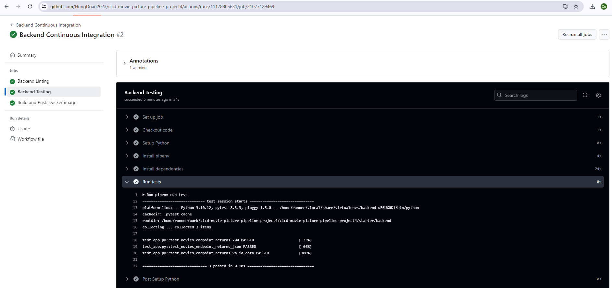

### Build CD Pipeline for Backend
1. Backend Continuous Deployment

### Creating, Setting AWS Resources & Github (EKS, ECR, Github)
1. Creating EKS
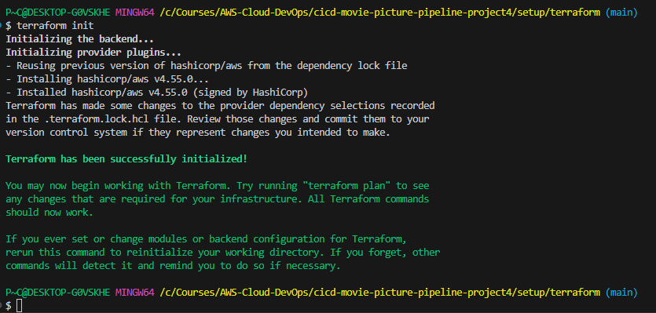

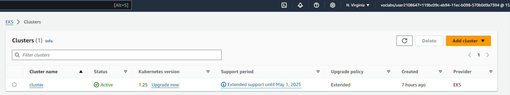

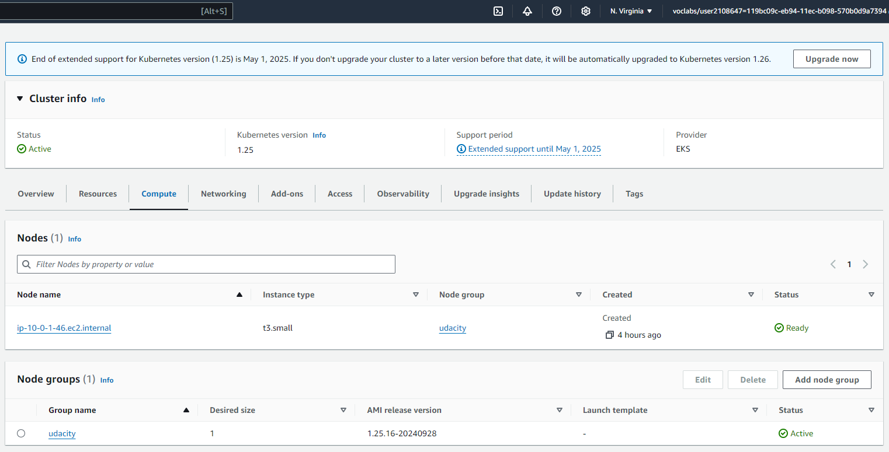

2. Creating Github Action User & Secret Environment
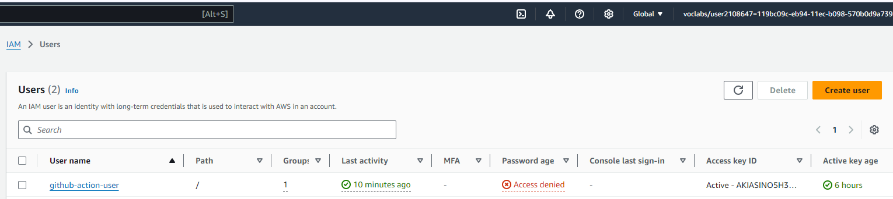

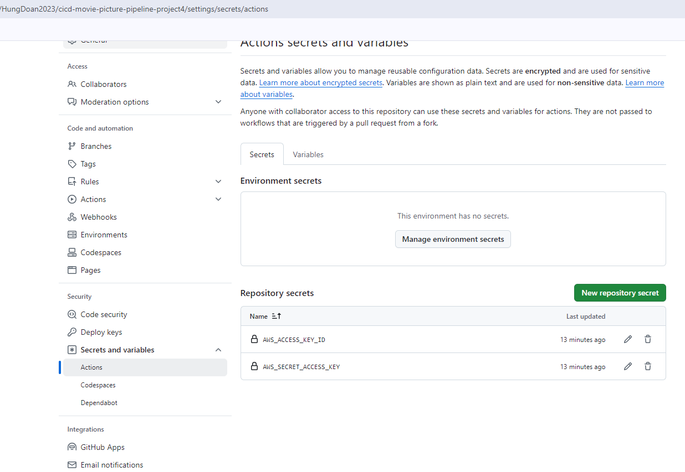

### List out Pods, Services
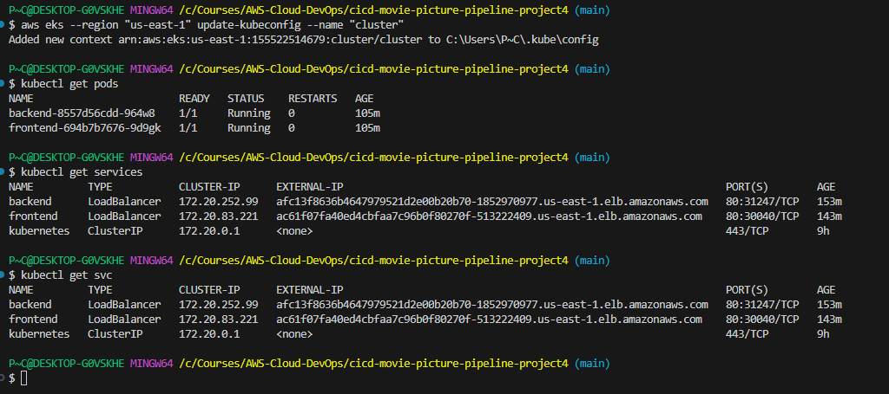

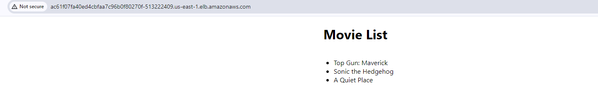

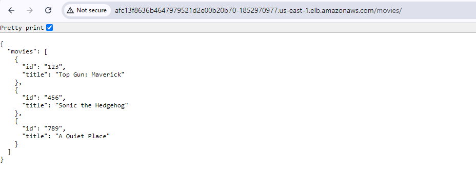

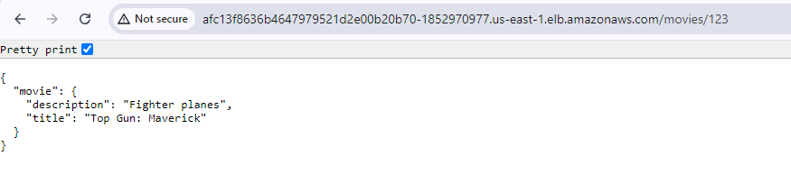

Display Movies List
http://ac61f07fa40ed4cbfaa7c96b0f80270f-513222409.us-east-1.elb.amazonaws.com/

Getting API
http://afc13f8636b4647979521d2e00b20b70-1852970977.us-east-1.elb.amazonaws.com/movies

### Thanks
Thanks Mentors, Coach and the good course so I have a lot of hand-on experience for working on this project. It made me has a good knownledge about CI/CD and how to approach to the appropriate CI/CD pipeline on some specific scenarios.
